# Dispensary Manager (Beta)

Author: Daniel Kelly 
danielkellydev@gmail.com 

Repository Link: https://github.com/danielkellydev/dispensary_manager

Display Manager is an application to assist herbalists in managing their herbal dispensary. At this point in time, there is included a small dispensary of 12 herbs, though in later versions there will be a feature to add new herbs to the dispensary. 

## App Features
 

### *Display full dispensary inventory*
Simply display the full list of herbs in the dispensary, and the current amount of grams. 

### *Display low stock items*
Rather than looking through the entire dispensary of herbs to check stock levels, you can use this function to single out all herbs that are under 100 grams. 

### *Update herb inventory*
When you do stock up herb inventories, this is the function you will use to record the new amounts of grams of a given herb. 

### *Prescribe Formula*
When you select a formula from the list to prescribe, the grams of the individual herbs will be deducted from the inventories, and hence provides an automated way to update herb inventories when formulas are prescribed. 

## App Implementation Plan

 

The implementation plan was created on an online platform called Asana. It can be accessed via the below link:

https://app.asana.com/0/1203497138825323/list

 

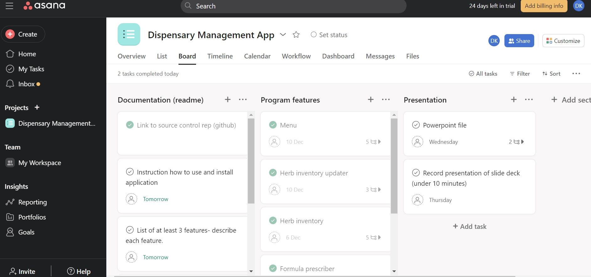 
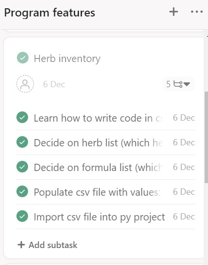 
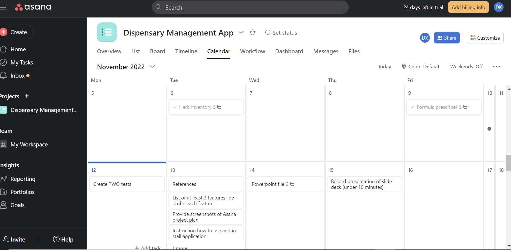

## Operating Instructions

### *Running the app*
Ensure terminal is in correct directory, then use the command `./run.sh` to start the app. Using the app does require the Pandas module, which installs automatically by running the run.sh executable. 

### *Menu*
The menu is navigated by entering the number index values. 

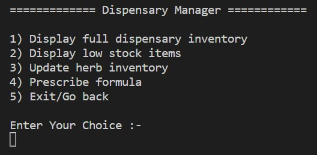

For example, enter `1` and press Enter to Display full dispensary inventory. 

 
 

## *Using the Features*
### *1) Display full dispensary inventory &* 
### *2) Display low stock items*
Not much instruction is needed for the first two options. Once these options are called, they simply display the requested data. To exit, press 5 and then Enter. 

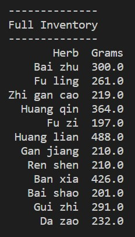

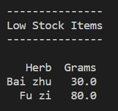

If there are no low stock herbs in the inventory, the app will indicate this by letting you know 'You're all stocked up!' 

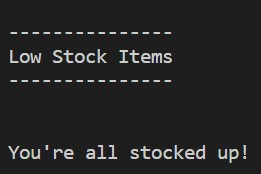

### *3) Update herb inventory*

When this feature opens, first enter the specific herb you would like to update. It doesn't matter which case you use ie. upper/lowercase, as the app will adjust cases automatically. Ensure to enter the correct spelling, and don't add any extra spaces onto the end of herb names. 

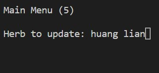

Hit Enter, and then enter the updated number of grams for the given herb. Enter numbers only. 
 

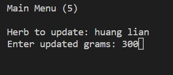

Hit Enter. A confirmation will be given. This feature will keep running until you go back to Main Menu, by entering command '5'. 

 

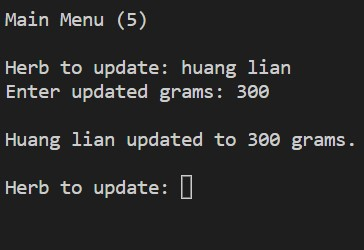

### *4) Prescribe Formula*

You will be presented with the formula list to choose from, simply use the number index to select which formula you're prescribing. 

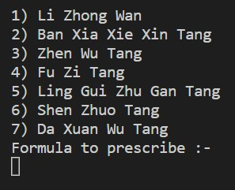

You will then receive a confirmation message. 

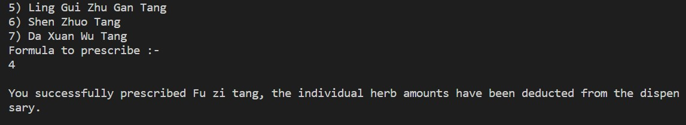

When finished with the program, use command 5 to exit app. 
 
 

## *References*

 
“7 Best Ways to Convert Dict to CSV in Python – Finxter.” Accessed December 9, 2022. https://blog.finxter.com/how-to-convert-dict-to-csv-in-python-4-ways/.

“How to Save a Python Dictionary to CSV File?” Accessed December 8, 2022. https://www.tutorialspoint.com/How-to-save-a-Python-Dictionary-to-CSV-file.

“How to Write and Report Assertions in Tests — Pytest Documentation.” Accessed December 12, 2022. https://docs.pytest.org/en/7.2.x/how-to/assert.html#assert.

“Import Csv File Python Code Examples & Solutions For This Technical Problem Cluster.” Accessed December 6, 2022. https://www.codegrepper.com/tpc/import+csv+file+python.

GeeksforGeeks. “Inventory Management with JSON in Python,” October 13, 2021. https://www.geeksforgeeks.org/inventory-management-with-json-in-python/.

Koech, Kiprono Elijah. “Python Dictionary and JSON — A Comprehensive Guide.” Analytics Vidhya (blog), June 9, 2022. https://medium.com/analytics-vidhya-python-dictionary-and-json-a-comprehensive-guide-ceed58a3e2ed.

lserlohn. “How to Print Pandas DataFrame without Index.” Forum post. Stack Overflow, August 9, 2018. https://stackoverflow.com/q/24644656.

Malli. “How to Print Pandas DataFrame without Index.” Spark by {Examples} (blog), October 27, 2021. https://sparkbyexamples.com/pandas/print-pandas-dataframe-without-index/.

“Pandas Read CSV.” Accessed December 9, 2022. https://www.w3schools.com/python/pandas/pandas_csv.asp.

“Pandas.DataFrame.Empty — Pandas 0.18.1 Documentation.” Accessed December 12, 2022. https://pandas.pydata.org/pandas-docs/version/0.18/generated/pandas.DataFrame.empty.html.

“Python Dictionary (With Examples).” Accessed December 9, 2022. https://www.programiz.com/python-programming/dictionary.

Python Tutorial: How to Create an Inventory Management System Using a Text File, 2021. https://www.youtube.com/watch?v=MX5_KgWdSRU.

GeeksforGeeks. “String Capitalize() in Python,” January 2, 2018. https://www.geeksforgeeks.org/string-capitalize-python/.
